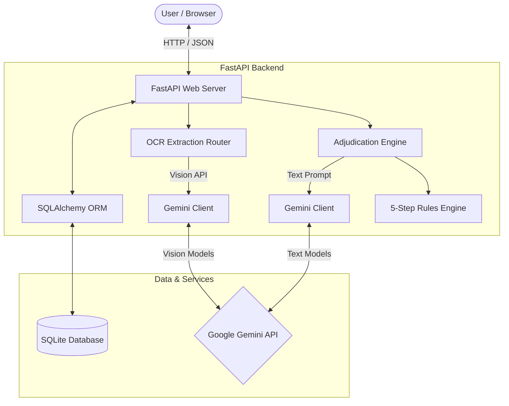
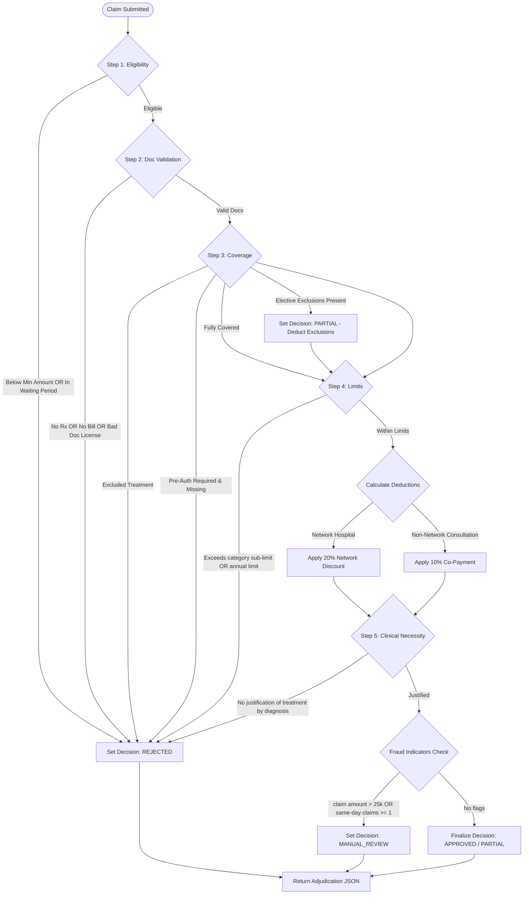

# ClaimIQ — Technical Documentation

## Project Overview

ClaimIQ is an AI-assisted OPD claim adjudication system built to automate insurance claim processing. The idea came from how tedious and error-prone manual claim reviews tend to be — reviewers have to cross-check multiple documents, apply policy rules, and flag suspicious activity, all by hand.

The system handles this by combining document extraction through Google Gemini with a rule-based adjudication engine. When a claim comes in, Gemini reads the uploaded prescription or bill and pulls out the relevant details. Those details then go through five policy checks — eligibility, document validation, coverage, limits, and clinical necessity — before a final decision is made.

The goal was to significantly reduce the manual effort required for OPD claim processing while keeping decisions transparent and easy to trace. Every claim produces a full audit trail showing which rule passed or failed and why.

---

## Technology Stack

| Layer | Technology | Notes |
|---|---|---|
| Backend | FastAPI (Python) | REST API server and request routing |
| Database | SQLite + SQLAlchemy | Claim persistence, stats aggregation |
| AI / OCR | Google Gemini | Document extraction and necessity check |
| Frontend | HTML, CSS, JavaScript | Single-page claim submission UI |
| Deployment | Railway | Cloud hosting, single service, public URL |

---

## System Architecture

ClaimIQ follows a straightforward client-server architecture. The frontend is a plain HTML/CSS/JS page that communicates with a FastAPI backend through REST APIs. Everything runs as a single service — the backend handles document extraction, adjudication, database operations, and dashboard statistics.

Inside the backend, two routers handle separate concerns. The OCR extraction router accepts file uploads, calls Gemini Vision, and returns structured JSON. The adjudication engine takes that data, runs it through the rules engine, optionally calls Gemini for the clinical necessity check, and writes the result to SQLite.



---

## API Documentation

All endpoints are served under the `/api` prefix. File uploads use multipart form data; everything else uses `application/json`.

### 1. Document Processing

#### `POST /api/extract-document`

Uploads a medical prescription or bill image or PDF. Gemini Vision extracts structured details which are returned as JSON and used to auto-fill the claim form.

**Request (Multipart Form Data)**
- `file` — JPG, PNG, WebP, GIF, or PDF, max 10 MB
- `doc_type` — optional: `auto`, `prescription`, `bill`, `diagnostic_report`, `pharmacy_bill`

**Response (JSON)**
```json
{
  "filename": "prescription_fever.pdf",
  "mime_type": "application/pdf",
  "size_kb": 3.0,
  "success": true,
  "document_type": "prescription",
  "extracted_data": {
    "patient_name": "Rajesh Kumar",
    "member_id": "EMP001",
    "treatment_date": "2024-11-01",
    "doctor_name": "Dr. Rajan Sharma",
    "doctor_registration": "KA/45678/2015",
    "hospital_name": "City Clinic",
    "diagnosis": "Viral Fever",
    "medicines_prescribed": ["Paracetamol 650mg", "Vitamin C"],
    "tests_prescribed": ["Complete Blood Count (CBC)"],
    "procedures": [],
    "bill_items": {
      "consultation_fee": 1000.0
    },
    "total_amount": 1000.0,
    "doctor_signature_present": true,
    "hospital_stamp_present": true
  },
  "raw_text": "...parsed raw text...",
  "confidence": 0.95,
  "notes": "",
  "ai_model": "gemini-2.0-flash"
}
```

---

### 2. Claims Management

#### `POST /api/claims`

Submits a claim payload, runs the AI necessity check and rules engine, and persists the decision to the database.

**Request (JSON)**
```json
{
  "member_id": "EMP001",
  "member_name": "Rajesh Kumar",
  "treatment_date": "2024-11-01",
  "claim_amount": 1500.0,
  "hospital": "City Clinic",
  "cashless_request": false,
  "member_join_date": "2024-01-01",
  "previous_claims_same_day": 0,
  "documents": { "...extracted_document_data..." }
}
```

**Response (JSON)**
```json
{
  "claim_id": "CLM_A90D22",
  "result": {
    "decision": "APPROVED",
    "approved_amount": 1350.0,
    "rejection_reasons": [],
    "confidence_score": 0.95,
    "audit_trail": ["...5-step checks..."],
    "deductions": {
      "copay": 150.0
    },
    "fraud_flags": [],
    "policy_rules_applied": ["..."],
    "notes": "All adjudication criteria satisfied. Claim approved.",
    "next_steps": "Your claim is approved. Payment will be processed within 3-5 business days.",
    "partial_items_excluded": [],
    "cashless_approved": false
  }
}
```

#### `GET /api/claims`

Returns a list of all claims in the system, sorted by submission date descending.

#### `GET /api/claims/{claim_id}`

Returns the complete adjudication result and metadata for a specific claim.

---

### 3. Policy & Dashboard

#### `GET /api/policy`

Returns the static JSON configuration containing waiting periods, sub-limits, network hospitals, and exclusions.

#### `GET /api/stats`

Aggregates claims in the SQLite database and returns summary statistics for the dashboard.

**Response (JSON)**
```json
{
  "total_claims": 4,
  "approved": 1,
  "rejected": 1,
  "partial": 1,
  "manual_review": 1,
  "approval_rate": 25.0,
  "successful_adjudications": 2,
  "success_rate": 50.0,
  "total_approved_amount": 8500.0,
  "avg_confidence": 86.5
}
```

#### `POST /api/test-runner/run-all`

Runs a suite of 10 pre-defined regression test cases directly against the adjudication engine.

---

## Decision Logic Flowchart

When a claim is submitted, the adjudication engine works through five validation steps in sequence. A claim can be rejected at any step. If it clears all five, a fraud check runs before the final decision is issued.



---

## Assumptions Made

### 1. Document Formats & Normalisation

- **Date Formats**: Treatment dates are expected in `YYYY-MM-DD` format for all internal comparisons. The AI parser is instructed to convert common formats like `01-Nov-2024`, `15/10/24`, and `November 15, 2024` into this format. The frontend also applies a `normalizeDate` helper during auto-fill to enforce this before submission.
- **Doctor Registration Numbers**: Doctor registrations must follow the `STATE/NUMBER/YEAR` pattern (e.g. `KA/45678/2015`, `AYUR/KL/2345/2019`) to pass the document validation step. Numbers that do not match this pattern are flagged as `DOCTOR_REG_INVALID`.

### 2. Category Detection

Bills do not carry standardised category tags, so the engine classifies claims using keyword heuristics on item descriptions.

- **Dental** — tooth, teeth, root canal, filling, dental
- **Vision** — eye, vision, optical, glasses, contact lens, lasik
- **Alternative Medicine** — ayurved, homeopath, panchakarma, unani, naturo
- **Diagnostic** — mri, ct scan, x-ray, blood test, cbc
- **Pharmacy** — all items match medicine-related keywords
- **General** — default for standard consultations

### 3. Exclusions & Deductions

- **Teeth Whitening**: Treated as a cosmetic procedure and excluded from dental claims. Rather than rejecting the entire claim, the whitening cost is deducted and the remainder (e.g. root canal) can still be partially approved.
- **Pre-authorisation**: Required for any diagnostic test involving MRI or CT scans. If absent, the engine rejects the claim under code `PRE_AUTH_MISSING`. To avoid false positives — for example, the word `function` in `pulmonary_function_test` containing the substring `ct` — matching is done on whole word boundaries only.
- **Network Hospital Discount**: If the hospital name matches the network list (Apollo, Fortis, Max, Manipal, Narayana), a 20% discount is applied automatically. No co-payment is charged for network hospitals.
- **Co-Payment**: A 10% co-payment is applied on outpatient consultations at non-network hospitals.

### 4. Fraud Detection & Manual Review

Claims are flagged as `MANUAL_REVIEW` if any of the following are true:

- The member has one or more previous claims on the same calendar day (frequency anomaly).
- The total claim amount is greater than ₹25,000 (high-value anomaly).

When flagged for manual review, the approved amount is stored as `0.0` in the database to protect financial statistics integrity until a claims officer completes the audit.

---

## Deployment

The application is deployed on Railway as a single FastAPI service. There is no separate frontend server — static files are served directly by FastAPI, so everything runs under one process and one public URL.

The deployed service includes:
- Frontend (HTML/CSS/JS) served as static files
- All backend REST API routes
- The rule-based adjudication engine
- Google Gemini integration for OCR and necessity checks
- SQLite database stored on the Railway volume

This setup means the application can be demoed through a public URL without any local setup. The SQLite file persists between deploys as long as it stays on the mounted volume.

### Planned: OAuth2 Authentication

One feature planned for a future iteration is implementing OAuth2 authentication, which would turn ClaimIQ into a proper multi-tenant platform. Right now all claims are visible to anyone with access to the dashboard. With OAuth2, each user would log in through a provider like Google, and the system would filter claim history so users only see their own submissions. This would also allow role-based access — claims officers could have a separate view with all claims, while regular members only see their own.

---

## Challenges Faced

### Inconsistent Document Formats

Medical bills and prescriptions come in different formats — handwritten, printed, scanned PDFs, even phone photos. Getting Gemini to extract structured data reliably from all of these took several prompt iterations. The final approach uses an explicit JSON schema in the system prompt and asks the model to default to `null` rather than guess when a field is unclear.

### Keeping AI Errors Away from Decisions

Early on, there was a risk that a bad extraction — say, Gemini misreading a date or inventing a diagnosis — could directly cause a wrong claim decision. The fix was to keep AI and rules completely separate: Gemini only extracts data and checks necessity; the final approve or reject decision always comes from deterministic policy rules.

### Substring Matching False Positives

The pre-auth check initially flagged any claim mentioning a test with `ct` in the name — which meant `pulmonary_function_test` would incorrectly require pre-authorisation. Switching to whole-word boundary regex matching resolved this without introducing other edge cases.

### Fraud Flags and Financial Integrity

When a claim is sent to manual review, it should not count as approved in the dashboard stats. Storing the approved amount as `0.0` for pending claims and only counting fully resolved decisions in the stats query handled this cleanly.

### Multi-Tenancy and Authentication

Currently the system does not enforce user-level access control, meaning all claims are visible on the shared dashboard. Implementing OAuth2 to make it a proper multi-tenant platform — where users only see their own claim history — was identified as a necessary next step but was scoped out of the initial version due to time constraints. Authentication and user-specific claim visibility are planned enhancements for future versions.
